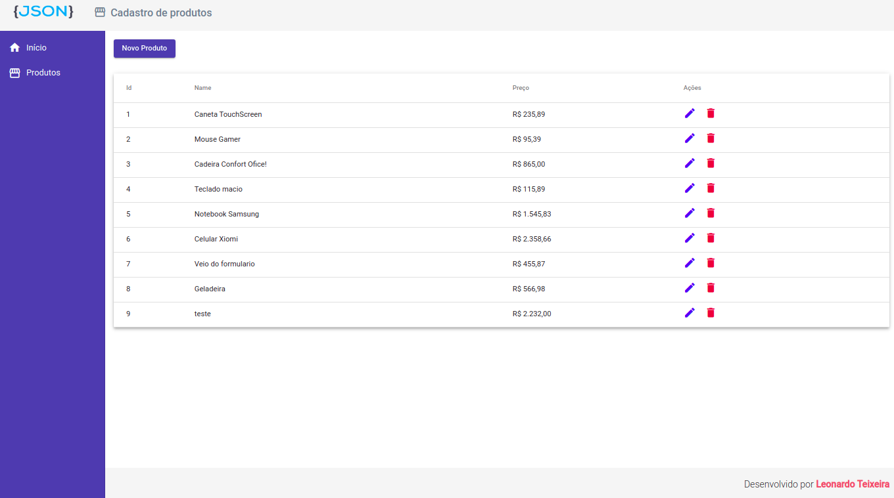
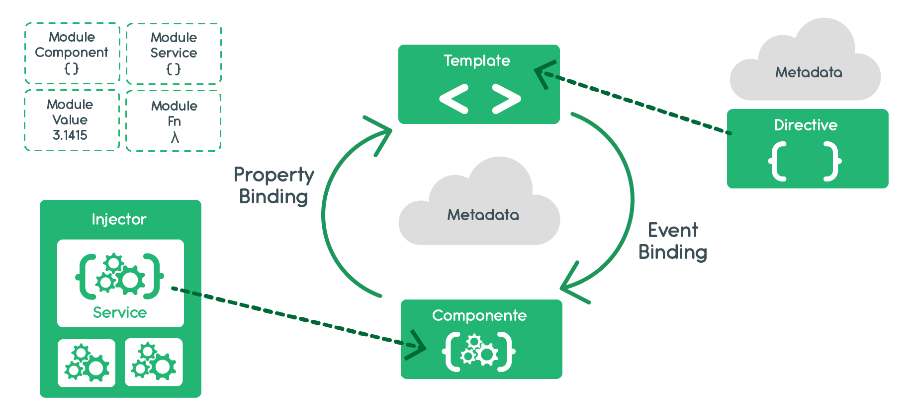

# angular-crud
Repositório destinado para estudo e prática dos principais conceitos em Angular 9 tanto do lado front-end quanto pelo Back-end utilizando JSON SERVER.
Acesse uma demonstração do sistema [clicando aqui ](https://i.imgur.com/669s3e5.mp4)

## Arquitetura base do sistema

### Tecnologias
* Angular CLI: 11.1.4
* Node: 15.5.1
* Material 11.2.7
* JSON Server: 0.16.3 [Acesse a documentação aqui](https://github.com/typicode/json-server)

## Como instalar
- Baixe ou clone este repositório usando `git clone https://github.com/leoteixeiraa/angular-crud.git`;
- Dentro do diretório, instale as dependências usando `npm install`.

## Como executar

No repositório **frontend** Execute `ng serve` para executar a versão de desenvolvimento. Depois acesse `http://localhost:4200/`.

Para executar o servidor de endpoints de API, em um outro terminal na pasta **backend** execute `npm run json-server` ou `npm start`. A API poderá ser acessada via `http://localhost:3000/`.

### Dúvidas
Caso haja alguma dúvida em relação a este repositório, envie para leovenancio00@gmail.com.